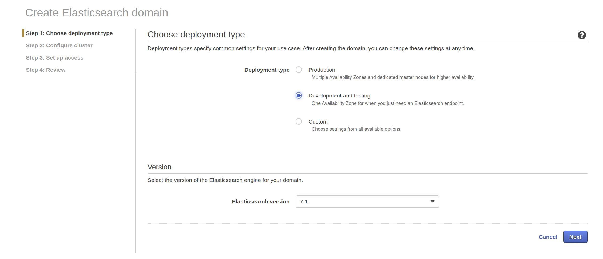
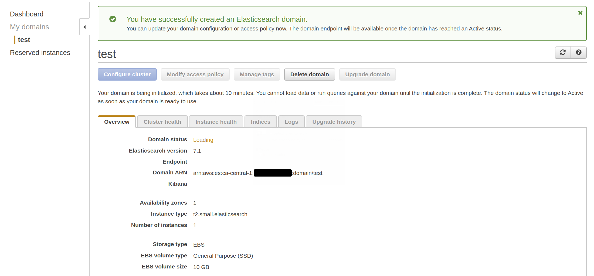

# Amazon Elasticsearch Service

Here are the steps involved in setting up an Elasticsearch cluster on AWS.

## AWS

AWS refers to an ES cluster as an 'Amazon ES domain', which is where we will start.

#### Create a domain

Pretty straightforward from the AWS console:



And:


[Note that the __Instance type__ is set to __small__; the default is __large__.]


[A VPC is perhaps overkill for a quick test; likewise Cognito.]


[Note the mandatory daily snapshot - specifically the time at which it occurs.]



[Note that it takes about 10 minutes to create the domain, also that there are no endpoints yet.]

As we did not enable Cognito for Kibana we will need to whitelist our IP address.

If using the AWS CLI, all of the above (plus IP address whitelisting) can be done as follows:

```bash
$ aws es create-elasticsearch-domain \
 --domain-name test \
 --elasticsearch-version 7.1 \
 --elasticsearch-cluster-config InstanceType=t2.small.elasticsearch,InstanceCount=1 \
 --ebs-options EBSEnabled=true,VolumeType=standard,VolumeSize=10 \
 --access-policies '{"Version":"2012-10-17","Statement":[{"Effect":"Allow","Principal":{"AWS":"*"},"Action":["es:*"],"Condition":{"IpAddress":{"aws:SourceIp":["your_ip_address"]}}}]}'
```

## Reference

Some useful references follow.

#### Glossary

Probably the place to start:

	http://www.elastic.co/guide/en/elasticsearch/reference/current/glossary.html

For instance, about __shards__:

> A shard is a single Lucene instance

Amazon layers their branding on top of Elastic's, so in AWS a cluster is known as an Amazon ES Domain.
Probably other terms are similiarly translated.

#### Mappings and Amazon Elasticsearch Service

If using Amazon Elasticsearch Service, their console can be used to view index mappings:


#### Upgrading Elasticsearch

AWS has a pretty good synopsis of their process for upgrading Elasticsearch:

    http://docs.aws.amazon.com/elasticsearch-service/latest/developerguide/es-version-migration.html

Elastic has a short summary also:

    http://www.elastic.co/guide/en/cloud/current/ec-migrate-data.html

[It's not particularly helpful, although it does recommend taking a snapshot first.]

#### AWS Developer Guide

Probably definitive when working with [Amazon Elasticsearch Service](http://aws.amazon.com/elasticsearch-service/):

    http://docs.aws.amazon.com/elasticsearch-service/latest/developerguide/what-is-amazon-elasticsearch-service.html
