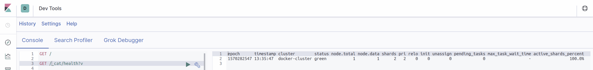
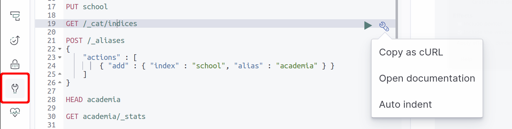
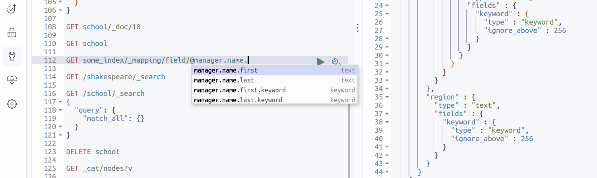
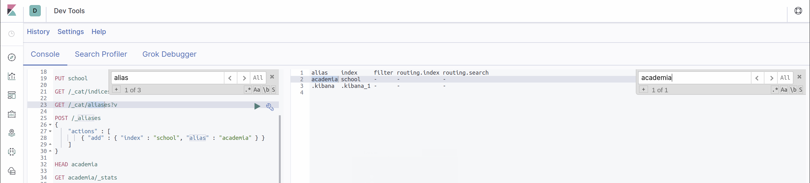
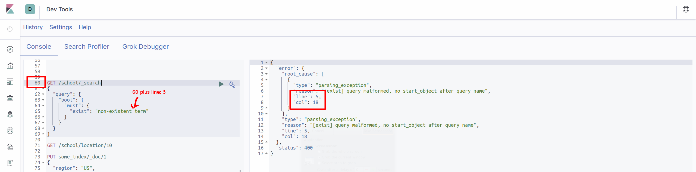
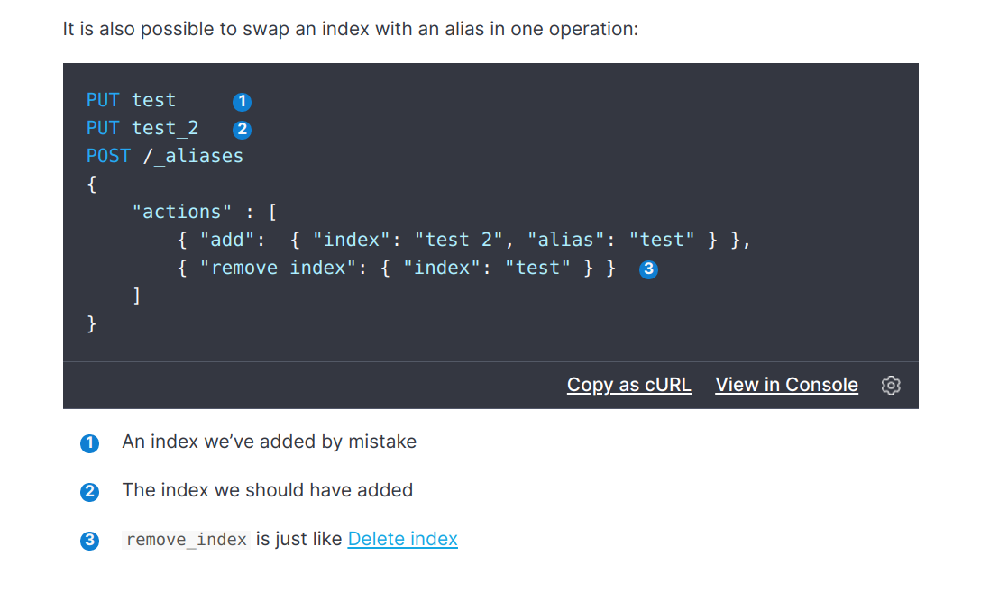
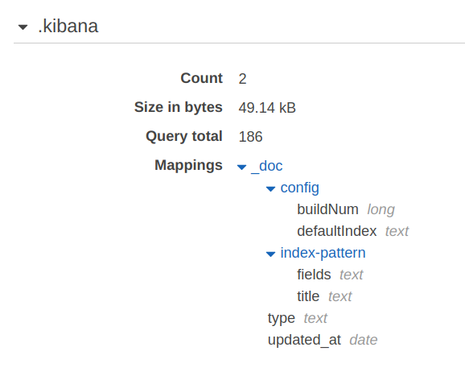

# Elastic


Getting up-to-speed with the __Elastic Stack__ (formerly the __ELK stack__) which consists of
 [Elasticsearch](http://www.elastic.co/products/elasticsearch),
 [Logstash](http://www.elastic.co/products/logstash), and
 [Kibana](http://www.elastic.co/products/kibana).


And now [Beats](http://www.elastic.co/products/beats).


## Contents

The content are as follows:

* [Motivation](#motivation)
* [Elasticsearch overview](#elasticsearch-overview)
* [Use Cases](#use-cases)
* [AWS](#aws)
* [GCP](#gcp)
* [Docker](docker)
* [Kubernetes](#kubernetes)
* [Version](#version)
* [Elasticsearch and Semver](#elasticsearch-and-semver)
* [Health](#health)
* [PUT](#put)
* [Indices](#indices)
* [Aliases](#aliases)
* [POSTs](#posts)
* [GET](#get)
    * [Specific query](#specific-query)
* [Kibana](#kibana)
    * [Useful commands](#useful-commands)
    * [Leading slashes](#leading-slashes)
    * [Human-readable output](#human-readable-output)
    * [Intellisense](#intellisense)
    * [Kibana tools](#kibana-tools)
    * [Ctrl-F is your friend](#ctrl-f-is-your-friend)
    * [Debugging](#debugging)
* [Searches](#searches)
    * [How to override the 10,000 items query limit](#how-to-override-the-10000-items-query-limit)
    * [Case](#case)
* [Leaf query clauses](#leaf-query-clauses)
    * [match](#match)
    * [term](#term)
    * [range](#range)
* [DELETE](#delete)
    * [DELETE individual item](#delete-individual-item)
    * [DELETE items](#delete-items)
* [Bulk loading](#bulk-loading)
* [Index/Alias problems](#indexalias-problems)
* [Aggregates](#aggregates)
* [Podcasts](#podcasts)
    * [SE-Radio](#se-radio)
    * [SE-Daily](#se-daily)
    * [The Changelog](#the-changelog)
* [Reference](#reference)
    * [Glossary](#glossary)
    * [Mappings](#mappings)
    * [Mappings and Amazon Elasticsearch Service](#mappings-and-amazon-elasticsearch-service)
    * [Dates](#dates)
    * [Number formatting](#number-formatting)
    * [Indices and Aliases](#indices-and-aliases)
    * [Bulk API](#bulk-api)
    * [Update documentation](#update-documentation)
    * [Reindex API](#reindex-api)
    * [Deprecation logging](#deprecation-logging)
    * [Upgrading Elasticsearch](#upgrading-elasticsearch)
    * [AWS Developer Guide](#aws-developer-guide)
    * [PUT and POST](#put-and-post)
* [Credits](#credits)

## Motivation

Having looked at [Cassandra with Python](http://github.com/mramshaw/Python_Cassandra), [Couchbase](http://github.com/mramshaw/RESTful-Couchbase) and [DynamoDB](http://github.com/mramshaw/DynamoDB),
 this time Elasticsearch is in the cross-hairs.

Under the covers ElasticSearch uses [Apache Lucene](http://lucene.apache.org/).

Elasticsearch is very similiar to [Apache Solr](http://lucene.apache.org/solr/).
Both ElasticSearch and Solr are built on top of Lucene, and seem to offer roughly
similiar features. It's worth remembering that ElasticSearch, while open-source,
is backed by a commercial (for-profit) company.

Amazon offers both as services: Elasticsearch is marketed as
 [Amazon Elasticsearch Service](http://aws.amazon.com/elasticsearch-service/)
 while Solr is marketed as [Amazon CloudSearch](http://aws.amazon.com/cloudsearch/).
Amazon Elasticsearch Service is based on a cluster of managed servers (where scaling
needs to be managed) while Amazon CloudSearch is a managed service which autoscales.

There are a number of options for Elasticsearch (on premise, etc), but I will be looking at
[Amazon Elasticsearch Service](#amazon-elasticsearch-service).

#### Amazon Elasticsearch Service

Amazon describes it as follows:

> Amazon Elasticsearch Service is a fully managed service that makes it easy for you to deploy, secure, and operate Elasticsearch at scale with zero down time.

[__at scale__, __zero down time__]

> The service offers open-source Elasticsearch APIs, managed [Kibana](http://aws.amazon.com/elasticsearch-service/the-elk-stack/kibana/), and integrations with
> [Logstash](http://aws.amazon.com/elasticsearch-service/the-elk-stack/logstash/) and other AWS Services, enabling you to securely ingest data from any source
> and search, analyze, and visualize it in real time.

[So a full ELK stack. This stack is popular with developers.]

> Amazon Elasticsearch Service lets you pay only for what you use – there are no upfront costs or usage requirements.

[So a good match for __serverless__ computing.]

All of the above quotes are from: http://aws.amazon.com/elasticsearch-service/

## Elasticsearch Overview

Elasticsearch is a __distributed__, __sharded__ database with __no required indices__.

It is a __NoSQL__ database, so theoretically __schema-less__ (although the recommended practice is to define a schema).

It is primarily oriented towards ___full-text search___.

In terms of NoSQL categories, it seems to usually be defined as a __real-time search and analytics engine__ first,
and a __Document store__ second. Of course, many relational databases also offer full-text search capabilities,
however it is probably its real-time streaming characteristics that make Elasticsearch attractive.

[As a document-store, it seems to offer a strong challenge to MongoDB. And it can also handle __search__.]

Elasticsearch seems to be very similiar to [Apache Cassandra](http://cassandra.apache.org/).

Cassandra has its own __CQL__ while Couchbase has __N1QL__; on the other hand Elasticsearch is __RESTful__.

> Scales good for reads, ok’ish for writes

From: http://vlkan.com/blog/post/2018/11/14/elasticsearch-primary-data-store/cncml-vienna-2019.pdf

Writes are handled via __shards__ while reads are handled by __replicas__. Replicas may be scaled up
dynamically (for instance, for Black Friday).

Its terminology is a little weird - for instance it refers to what might normally be called __databases__ as __indices__.

[It seems these actually were just indices - just with the data included (this enables re-indexing, which is a big plus).]

Integrity is maintained with a [CAS](http://en.wikipedia.org/wiki/Compare-and-swap) (compare and swap) versioning mechanism.

It's a little unusual (for a database anyway) in that it offers __fuzzy search__ options.

## Use Cases

As noted above, Elasticsearch is optimized for __search__, and more specifically - ___full-text search___.

Due to it's ability to ingest and scan documents, it is becoming very useful for __data science__ also.

For log ingestion and analysis, offerings from __DataDog__ and __Splunk__ may be more feature-rich,
but this is still a very common use case for Elasticsearch.

For assembling data from disparate sources, standardization and enrichment (if needed) are critical.
Elastic has recognized this - and offer [Beats](http://www.elastic.co/products/beats) to cover most
eventualities.

Elasticsearch also offers easy integration for [Machine Learning](http://www.elastic.co/what-is/elasticsearch-machine-learning).

## AWS

It is possible to create an AWS test cluster from http://www.elastic.co/ but it is also possible to do this from AWS itself.

Follow the link to see the steps involved with the [AWS option](01-Amazon_Elasticsearch_Service.md).

## GCP

Of course, Elasticsearch is also available on [GCP](http://www.elastic.co/about/partners/google-cloud-platform),
which may in fact be a stronger option than the AWS offering (which tends to lag behind the ES releases).

## Docker

Follow the link to see the steps involved with the [Docker option](02-Docker.md).

## Kubernetes

And of course, if ES is available on Docker, it's no surprise to see it available on
[Kubernetes](http://www.elastic.co/products/elastic-cloud-kubernetes) - where it can
also be used as an alternative to the default Stackdriver logging.

## Version

Let's see what version of Elasticsearch we are dealing with first.

Click the wrench icon (LHS) to navigate to the Kibana __Dev Tools__ console.

From the Kibana __Dev Tools__ console:

```
GET /
```

[Click the green Play button to execute]

Response:

```
{
  "name" : "b7f9cb7ad431",
  "cluster_name" : "docker-cluster",
  "cluster_uuid" : "uXuvtXXnQpSJ3I-F9VqxBg",
  "version" : {
    "number" : "7.3.1",
    "build_flavor" : "default",
    "build_type" : "docker",
    "build_hash" : "4749ba6",
    "build_date" : "2019-08-19T20:19:25.651794Z",
    "build_snapshot" : false,
    "lucene_version" : "8.1.0",
    "minimum_wire_compatibility_version" : "6.8.0",
    "minimum_index_compatibility_version" : "6.0.0-beta1"
  },
  "tagline" : "You Know, for Search"
}
```

[This should exactly match what we got from our ES cluster via our http://localhost:9200 URL.]

Note the version number (affects API calls, etc) which is __7.3.1__.

## Elasticsearch and Semver

THIS POINT CANNOT BE STRESSED ENOUGH. YOU HAVE BEEN WARNED!

Elastic does not follow the standard practice (usually referred to as __Semver__ or [Semantic Versioning](http://semver.org/))
of only releasing breaking changes with major releases.

[This is based upon my own personal experience, but feel free to disregard my comments.]

While it should be expected there *might* be breaking changes going from a 6.y.z version to a 7.y.z version,
it seems there are often breaking changes going from a x.1.z version to an x.2.z version. As an example, for
creating aggregate histograms in Elasticsearch __7.1.1__ versus __7.2.1__, the ___interval___ keyword was
deprecated and replaced with ___calendar_interval___ and/or ___fixed_interval___.

Compare:

    https://www.elastic.co/guide/en/elasticsearch/reference/7.1/search-aggregations-bucket-datehistogram-aggregation.html

And:

    https://www.elastic.co/guide/en/elasticsearch/reference/7.2/search-aggregations-bucket-datehistogram-aggregation.html

While it may be that the new terms have clearer semantics than the old term, and while I applaud Elastic for continuing to
support and expand their software, I think a good argument could be made that this type of change requires a __major release__
and not simply a __minor release__.

[I have not tested this so it may well be that ___interval___ will not actually be removed until the next major release,
 however no developer really likes breaking changes and there seem to have been far too many of these during the brief
 time that I have been working with Elasticsearch. The problem with breaking changes is not so much that code needs to
 be changed - every developer expects and understands this - but that it then needs to be __tested__ afterwards.
 Testing code that may have been running happily for some time can often turn out to be a non-trivial problem.]

## Health

Let's check the health of our cluster:

From the Kibana __Dev Tools__ console:

```
GET /_cat/health?v
```

Which should look something like the following:



## PUT

Let's create an index (database instance) first.

[This step is actually optional as Elasticsearch will *auto-magically* create indices and types that
 do not exist, but it is a good step to try in terms of getting familiar with Elasticsearch and Kibana.]

From the Kibana __Dev Tools__ console:

```
PUT school
```

[Creates index - Click the green Play button to execute]

Response:

```
{
  "acknowledged" : true,
  "shards_acknowledged" : true,
  "index" : "school"
}
```

To delete the index (database instance), there is [DELETE](#delete).

## Indices

Having created an index, let's see what indices we have:

From the Kibana __Dev Tools__ console:

```
GET /_cat/indices
```

[Click the green Play button to execute]

Response:

```
green  open .kibana_task_manager Bw7bdH5oTBOPIwB7JrzXaQ 1 0 2 0 45.5kb 45.5kb
yellow open school               HOGuhBS5TKCjpP84f-CnjQ 1 1 0 0   230b   230b
green  open .kibana_1            DuPECNdXSJu0vaUeOnmwxA 1 0 3 0 11.7kb 11.7kb
```

[The `yellow` status for our schools index indicates we do not have the recommended number of replicas
 for our school index, which is fine for a testing cluster. This is a warning status, where `red`
 indicates an error condition and `green` signifies `all systems go`. So a standard traffic light.]

Note that `/_cat/indices` will not show [Aliases](#aliases).

## Aliases

A definition:

> aliases are like soft links or shortcuts to actual indexes
>
> the advantage is to be able to have an alias pointing to index1a while building or
> re-indexing on index2b and the moment of swapping them is atomic thanks to the alias

As:

> Renaming an alias is a simple remove then add operation within the same API. This operation is atomic,
> no need to worry about a short period of time where the alias does not point to an index

Also:

> Multiple indices can be specified for an action

And:

> We will talk more about the other uses for aliases later in the book. For now we will explain how to
> use them to switch from an old index to a new index with zero downtime.

All from: http://stackoverflow.com/questions/48907041/what-are-aliases-in-elasticsearch-for

So let's create an alias.

From the Kibana __Dev Tools__ console:

```
POST /_aliases
{
    "actions" : [
        { "add" : { "index" : "school", "alias" : "academia" } }
    ]
}
```

[Click the green Play button to execute]

Response:

```
{
  "acknowledged" : true
}
```

And check it exists (200 for yes, 404 for no):

```
HEAD academia
```

[Click the green Play button to execute]

Response:

```
200 - OK
```

And check out the statistics for this alias:

```
GET academia/_stats
```

And just for fun, <kbd>Ctrl-Enter</kbd> (on OS/X, <kbd>Command-Enter</kbd>) to execute:

```
{
  "_shards" : {
    "total" : 2,
    "successful" : 1,
    "failed" : 0
  },
  "_all" : {
    "primaries" : {
      "docs" : {

    ...

      }
    },
    "total" : {
      "docs" : {

    ...

      }
    }
  },
  "indices" : {
    "school" : {
      "uuid" : "JN_oqm2fTfCyjSMzWskbfA",
      "primaries" : {
        "docs" : {

    ...

        }
      },
      "total" : {
        "docs" : {

    ...

        },
        "fielddata" : {
          "memory_size_in_bytes" : 0,
          "evictions" : 0

    ...

        }
      }
    }
  }
}
```

[In general, use of `fielddata` is probably to be avoided.]

## POSTs

Now let's create some entries.

From the Kibana __Dev Tools__ console:

```
POST school/_doc/10
{
   "name":"Saint Paul School", "description":"ICSE Afiliation",
   "street":"Dawarka", "city":"Delhi", "state":"Delhi", "zip":"110075",
   "location":[28.5733056, 77.0122136], "fees":5000,
   "tags":["Good Faculty", "Great Sports"], "rating":"4.5"
}
```

[Click the green Play button to execute]

Response:

```
{
  "_index" : "school",
  "_type" : "_doc",
  "_id" : "10",
  "_version" : 1,
  "result" : "created",
  "_shards" : {
    "total" : 2,
    "successful" : 1,
    "failed" : 0
  },
  "_seq_no" : 0,
  "_primary_term" : 1
}
```

[Looks like anything starting with an underscore is metadata.]

And:

```
POST school/_doc/16
{
   "name":"Crescent School", "description":"State Board Affiliation",
   "street":"Tonk Road",
   "city":"Jaipur", "state":"RJ", "zip":"176114","location":[26.8535922,75.7923988],
   "fees":2500, "tags":["Well equipped labs"], "rating":"4.5"
}
```

[Click the green Play button to execute]

Response:

```
{
  "_index" : "school",
  "_type" : "_doc",
  "_id" : "16",
  "_version" : 1,
  "result" : "created",
  "_shards" : {
    "total" : 2,
    "successful" : 1,
    "failed" : 0
  },
  "_seq_no" : 0,
  "_primary_term" : 1
}
```

## GET

Let's get a description (definition) of our index.

From the Kibana __Dev Tools__ console:

```
GET school
```

[Click the green Play button to execute]

Response:

```
{
  "school" : {
    "aliases" : { },
    "mappings" : {
      "_doc" : {
        "properties" : {
          "city" : {
            "type" : "text",
            "fields" : {
              "keyword" : {
                "type" : "keyword",
                "ignore_above" : 256
              }
            }
          },
          "description" : {
            "type" : "text",
            "fields" : {
              "keyword" : {
                "type" : "keyword",
                "ignore_above" : 256
              }
            }
          },
          "fees" : {
            "type" : "long"
          },
          "location" : {
            "type" : "float"
          },
          "name" : {
            "type" : "text",
            "fields" : {
              "keyword" : {
                "type" : "keyword",
                "ignore_above" : 256
              }
            }
          },
          "rating" : {
            "type" : "text",
            "fields" : {
              "keyword" : {
                "type" : "keyword",
                "ignore_above" : 256
              }
            }
          },
          "state" : {
            "type" : "text",
            "fields" : {
              "keyword" : {
                "type" : "keyword",
                "ignore_above" : 256
              }
            }
          },
          "street" : {
            "type" : "text",
            "fields" : {
              "keyword" : {
                "type" : "keyword",
                "ignore_above" : 256
              }
            }
          },
          "tags" : {
            "type" : "text",
            "fields" : {
              "keyword" : {
                "type" : "keyword",
                "ignore_above" : 256
              }
            }
          },
          "zip" : {
            "type" : "text",
            "fields" : {
              "keyword" : {
                "type" : "keyword",
                "ignore_above" : 256
              }
            }
          }
        }
      }
    },
    "settings" : {
      "index" : {
        "creation_date" : "1566930221735",
        "number_of_shards" : "5",
        "number_of_replicas" : "1",
        "uuid" : "xxxxxxxxxxxxxxxxxxxxxx",
        "version" : {
          "created" : "6050499"
        },
        "provided_name" : "school"
      }
    }
  }
}
```

[fees is a ___long___, zip is a ___float___; others are text fields.]

#### Specific Query

Now let's try retrieving a specific entry.

From the Kibana __Dev Tools__ console:

```
GET /school/_search?q=name:"Saint Paul School"
```

[Click the green Play button to execute]

Response:

```
{
  "took" : 46,
  "timed_out" : false,
  "_shards" : {
    "total" : 5,
    "successful" : 5,
    "skipped" : 0,
    "failed" : 0
  },
  "hits" : {
    "total" : 1,
    "max_score" : 0.8630463,
    "hits" : [
      {
        "_index" : "school",
        "_type" : "_doc",
        "_id" : "10",
        "_score" : 0.8630463,
        "_source" : {
          "name" : "Saint Paul School",
          "description" : "ICSE Afiliation",
          "street" : "Dawarka",
          "city" : "Delhi",
          "state" : "Delhi",
          "zip" : "110075",
          "location" : [
            28.5733056,
            77.0122136
          ],
          "fees" : 5000,
          "tags" : [
            "Good Faculty",
            "Great Sports"
          ],
          "rating" : "4.5"
        }
      }
    ]
  }
}
```

## Kibana

Kibana is an open-source data visualization plugin for Elasticsearch.



Click the wrench icon (LHS) to navigate to the Kibana __Dev Tools__ console.

Your last few Kibana Dev Tools sessions will be cached, which is a very useful feature.

#### Useful commands

Check cluster is running:

    GET /

Check cluster health:

    GET /_cat/health?v

List all indices:

    GET /_cat/indices?v

List all aliases:

    GET /_cat/aliases?v

List an index's aliases, mappings and settings:

    GET /some_index

List _only_ an index's mappings:

    GET /some_index/_mapping

    GET /some_alias/_mapping

How to check a field's mapping:

    GET /some_index/_mapping/field/some_field

    GET /some_alias/_mapping/field/some_field

#### Leading slashes

In general leading slashes may be omitted. However, as they are *sometimes* needed,
perhaps a better practice is to get into the habit of ___always___ using a leading slash.

#### Human-readable output

For human-readable output add __?v__ to the end of the initial line:

    GET /_cat/indices

Gives:

```
yellow open some_index           JDyFX-XjQMu95f3KXZnPpQ 1 1 1 0    5kb    5kb
green  open .kibana_task_manager 4wLH-SPCRTKreXpzmjmhoA 1 0 2 0 79.1kb 79.1kb
green  open .kibana_1            Un0M5PpqTlWDlib_qmsXGw 1 0 4 1 23.9kb 23.9kb
```

While:

    GET /_cat/indices?v

Gives:

```
health status index                uuid                   pri rep docs.count docs.deleted store.size pri.store.size
yellow open   some_index           JDyFX-XjQMu95f3KXZnPpQ   1   1          1            0        5kb            5kb
green  open   .kibana_task_manager 4wLH-SPCRTKreXpzmjmhoA   1   0          2            0     79.1kb         79.1kb
green  open   .kibana_1            Un0M5PpqTlWDlib_qmsXGw   1   0          4            1     23.9kb         23.9kb
```

#### Intellisense

Kibana has a really useful `Intellisense` auto-complete feature:



#### Kibana tools

In addition to executing Elasticsearch queries (green Play button),
the Dev Tools console in Kibana also has some nice tools (diagonal wrench icon).

cURL (from Spanner - 'Copy as cURL'):

	curl -XGET "http://localhost:9200/school/_search?q=rating:4.5"

The 'Auto indent' feature is also useful - it toggles between expanded and compact formats.
It will only work for correctly-formatted JSON, which can be a quick and convenient way to
check for correctly-formed JSON.

#### Ctrl-F is your friend

The workspaces in Kibana can get pretty crowded very quickly, so being able to find things
via ___searching___ is a very nice feature. It is possible to search in both the __query__
and the __results__ panels, as the following screencap shows:



#### Debugging

Although the Kibana workspace can include dozens of queries, the results panel will always
refer to the current Elasticsearch command as if it had been executed in isolation.

Spacing out your query so it starts on a line ending in a __1__ should make debugging and
problems slightly easier, as the following annotated screencap shows:



## Searches

It is possible to search without any criteria (a 'match all query', the equivalent of `head` or `tail` in *nix) to explore data.

```
GET /shakespeare/_search
```

#### How to override the 10,000 items query limit

There is a soft limit of 10,000 items on queries. This is to prevent runaway queries from killing the cluster.

[The 10,000 items soft limit for queries was introduced with Elasticsearch 7.0+]

To report on more than 10,000 items, add the following line:

`"track_total_hits": true,`

As in:

```
GET some_index/_search
{
  "track_total_hits": true,
  "query": {
    "bool": {
      "must_not": {
        "exists": {
          "field": "some_field"
        }
      }
    }
  }
}
```

[This is a query for all documents that do not contain the term 'some_field'.]

#### Case

Case is important - in some cases only lower-case will match (presumably text fields are canonicalized,
so "USD" will only match if "usd" is requested), whereas in other situations only the exact text will match:

```
GET /_search
{
    "query": {
        "query_string" : {
            "default_field" : "city",
            "query" : "jaipur"
        }
    }
}
```

[Click the green Play button to execute]

Response:

```
{
  "took" : 53,
  "timed_out" : false,
  "_shards" : {
    "total" : 324,
    "successful" : 324,
    "skipped" : 0,
    "failed" : 0
  },
  "hits" : {
    "total" : 1,
    "max_score" : 0.2876821,
    "hits" : [
      {
        "_index" : "school",
        "_type" : "_doc",
        "_id" : "16",
        "_score" : 0.2876821,
        "_source" : {
          "name" : "Crescent School",
          "description" : "State Board Affiliation",
          "street" : "Tonk Road",
          "city" : "Jaipur",
          "state" : "RJ",
          "zip" : "176114",
          "location" : [
            26.8535922,
            75.7923988
          ],
          "fees" : 2500,
          "tags" : [
            "Well equipped labs"
          ],
          "rating" : "4.5"
        }
      }
    ]
  }
}
```

## Leaf query clauses

http://www.elastic.co/guide/en/elasticsearch/reference/current/query-dsl.html

#### match

Seems to be used for exact matches (EQ).

#### term

Seems to be used for text matching - contains the specified term (LIKE, etc).

#### range

Used for numeric matching (LT, LTE, GT, GTE).

```
GET /_search
{
  "query": {
    "range": {
      "fees": {
        "gt": "2500"
      }
    }
  }
}
```

[Click the green Play button to execute]

Response:

```
{
  "took" : 9,
  "timed_out" : false,
  "_shards" : {
    "total" : 324,
    "successful" : 324,
    "skipped" : 319,
    "failed" : 0
  },
  "hits" : {
    "total" : 1,
    "max_score" : 1.0,
    "hits" : [
      {
        "_index" : "school",
        "_type" : "_doc",
        "_id" : "10",
        "_score" : 1.0,
        "_source" : {
          "name" : "Saint Paul School",
          "description" : "ICSE Afiliation",
          "street" : "Dawarka",
          "city" : "Delhi",
          "state" : "Delhi",
          "zip" : "110075",
          "location" : [
            28.5733056,
            77.0122136
          ],
          "fees" : 5000,
          "tags" : [
            "Good Faculty",
            "Great Sports"
          ],
          "rating" : "4.5"
        }
      }
    ]
  }
}
```

It's pretty error-tolerant, even the following worked:

```
GET /_search
{
  "query": {
    "range": {
      "eventAt": {
        "gte": "2500"
      }
    }
  }
}
```

## term query may return poor results when searching text fields

http://www.elastic.co/guide/en/elasticsearch/reference/current/query-dsl-term-query.html#avoid-term-query-text-fields

## DELETE

Deletes the specified index (and all of the indexed data as well):

```
DELETE school
```

[Click the green Play button to execute]

Response:

```
{
  "acknowledged" : true
}
```

#### DELETE individual item

```
DELETE school/_doc/10
```

[Click the green Play button to execute]

Response:

```
{
  "_index" : "school",
  "_type" : "_doc",
  "_id" : "10",
  "_version" : 2,
  "result" : "deleted",
  "_shards" : {
    "total" : 2,
    "successful" : 1,
    "failed" : 0
  },
  "_seq_no" : 1,
  "_primary_term" : 1
}
```

[Note that __result__ is __deleted__; also __version__ is __2__ as index has been deleted and then re-created.]

#### DELETE items

If you are brave, things like this usually work:

```
DELETE some_index
{
 "query": {
   "exists": {
     "field": "some_field"
   }
 }
}
```

[The risk of deleting more documents than you intended hardly needs to be stated.]

## Bulk loading

Bulk loading can be accessed at `/_bulk`.

Using `curl` [more schools](./more_schools) can be loaded as follows:

```bash
$ curl -H "Content-Type: application/x-ndjson" -XPOST localhost:9200/school/_bulk?pretty --data-binary "@more_schools"; echo
```

[The __?pretty__ option means pretty-print the output. This can be omitted. Can optionally add the `--silent` option to curl.
 The `; echo` part at the end is simply to get a newline so that our console output is readable.]

## Index/Alias problems

It is quite easy to get into a chicken & egg situation with indices and aliases. Apparently this is a common enough
problem that there is a pretty easy fix:



From: https://www.elastic.co/guide/en/elasticsearch/reference/current/indices-aliases.html

## Aggregates

Aggregates are kind of a fancy way to say ___summaries___.

It's possible to specify that you only want the big picture (no details) by specifying `"size": 0`:

```
GET some_index/_search
{
  "query": {...},
  "size": 0,
  "aggregations": {
    "dateHistogram": {
      "date_histogram": {
        "field": "@timestamp",
        "fixed_interval": "10s"
      }
    }
  }
}
```

## Podcasts

Some of the following podcast episodes may be helpful for getting an overview of Elasticsearch.

#### SE-Radio

> Software Engineering Radio is a podcast targeted at the professional software developer.

A good overview of the Elastic Stack:

    http://www.se-radio.net/2017/05/se-radio-episode-292-philipp-krenn-on-elasticsearch/

Jeff Meyerson, the interviewer, went on to found [Software Engineering Daily](http://softwareengineeringdaily.com/).

As the stack has evolved, Logstash seems to have spilt into [Beats](http://www.elastic.co/products/beats) (which are
aggregation agents that can ship to either Elasticsearch or Logstash) and [Logstash](http://www.elastic.co/products/logstash)
(which is used for data ingestion and parsing - and also enrichment [for instance, geolocating IP addresses]).

[Apparently geolocation has evolved to become a strength of Elasticsearch. And __types__ are on their way out.]

Presumably well-structured data can be shipped to Elasticsearch directly by Beats, but less well-structured data
(that may need to be parsed, processed, aggregated, transformed or enriched) must be passed to Logstash instead.

#### SE-Daily

> Software Engineering Daily features daily interviews about technical software topics.

An interesting chat about using ElasticSearch at Scale:

    http://softwareengineeringdaily.com/2019/03/20/elasticsearch-at-scale-with-volkan-yazici/

Jeff Meyerson interviews Volkan Yazici about his blog post "Using Elasticsearch as the Primary Data Store":

    http://vlkan.com/blog/post/2018/11/14/elasticsearch-primary-data-store/

Summary points:

* Elasticsearch does not handle frequent updates particularly well
* Dynamic fields such as ___prices___ are not normally completely up-to-date but need to be indexed so as to be searchable
* Nested fields (or objects) can be problematic
* Great for real-time streaming (which probably correlates with eventual consistency)

And a quote:

> Cassandra is really difficult to operate if you want to have it in your own premises. But compared with that Elasticsearch, you can get it right without breaking a sweat.

[Interesting and well worth a listen.]

#### The Changelog

> News and podcasts for developers

[The Changelog](http://changelog.com/) is a podcast is its right, as well as an umbrella organization for various other interesting podcasts

Jerod and Adam talk with Philipp Krenn about Elasticsearch and doubling down on "open"

    http://changelog.com/podcast/292

Some interesting discussions about software licenses and Elasticsearch as a replacement for PostgreSQL's full-text search

[Some good background about search in general and Elasticsearch in particular.]

## Reference

Some useful references follow.

#### Glossary

Probably the place to start:

	http://www.elastic.co/guide/en/elasticsearch/reference/current/glossary.html

For instance, about __shards__:

> A shard is a single Lucene instance

Amazon layers their branding on top of Elastic's, so in AWS a cluster is known as an Amazon ES Domain.
Probably other terms are similiarly translated.

#### Mappings

It is impossible to do much in ES without understanding mappings. Read this page:

    http://www.elastic.co/guide/en/elasticsearch/reference/current/mapping.html

Individual mappings (fees, in this case) may be checked with `GET /school/_mapping/field/fees`.

#### Mappings and Amazon Elasticsearch Service

If using Amazon Elasticsearch Service, their console can be used to view index mappings:



#### Dates

Careful consideration needs to be paid to dates, as most queries will involve time-related processing or date ranges:

    http://www.elastic.co/guide/en/elasticsearch/reference/current/date.html

Time processing in Elasticsearch is generally processed in either seconds or milliseconds, however __Elasticsearch 7.0__
introduced nanosecond processing as an option (internally, Elasticsearch 7.0+ processing will use nanoseconds).

Interestingly, Elasticsearch can support __multiple date formats__ at the same time:

    http://www.elastic.co/guide/en/elasticsearch/reference/current/date.html#multiple-date-formats

For date processing with Javascript, there is [Luxon](http://moment.github.io/luxon/).

[Luxon operates in milliseconds.]

#### Number formatting

It is possible to format numbers:

    http://numeraljs.com/

#### Indices and Aliases

The index APIs:

    https//www.elastic.co/guide/en/elasticsearch/reference/current/indices.html

A little long, but worth reading:

    http://www.elastic.co/guide/en/elasticsearch/reference/current/indices-aliases.html

#### Bulk API

> The bulk API makes it possible to perform many index/delete operations in a single API call. This can greatly increase the indexing speed.

    http://www.elastic.co/guide/en/elasticsearch/reference/current/docs-bulk.html

Note that a successful __create__ returns a __201__ HTTP status code while an unsuccessful __delete__ returns a __404__ HTTP status code.

The __update__ (usually an __upsert__ I think) should normally return a __200__ HTTP status code.

> When using the `update` action, `retry_on_conflict` can be used as a field in the action itself
> (not in the extra payload line), to specify how many times an update should be retried in the case of a version conflict.

And:

> The `update` action payload supports the following options: `doc` (partial document), `upsert`, `doc_as_upsert`, `script`, `params` (for script),
> `lang` (for script), and `_source`. See update documentation for details on the options.

[Both quotes are from the article linked above.]

#### Update documentation

The update documentation is available here:

    http://www.elastic.co/guide/en/elasticsearch/reference/current/docs-update.html

#### Reindex API

Indices (database instances) are - for all practical purposes - immutable.

[It's possible to add fields, and change the display formats of existing fields,
 but that's about it.]

In order to make any changes to the field mappings, it is pretty much required to reindex.

This can actually be pretty fast: with a medium-sized cluster, millions of documents can
 be reindexed in a matter of minutes.

Note that the `destination` index must be set up before the reindex:

    http://www.elastic.co/guide/en/elasticsearch/reference/current/docs-reindex.html

#### Deprecation logging

This should be enabled, especially if you are planning on upgrading Elasticsearch in the near future.

> In addition to regular logging, Elasticsearch allows you to enable logging of deprecated actions.

from: http://www.elastic.co/guide/en/elasticsearch/reference/7.0/logging.html#deprecation-logging

#### Upgrading Elasticsearch

AWS has a pretty good synopsis of their process for upgrading Elasticsearch:

    http://docs.aws.amazon.com/elasticsearch-service/latest/developerguide/es-version-migration.html

Elastic has a short summary also:

    http://www.elastic.co/guide/en/cloud/current/ec-migrate-data.html

[It's not particularly helpful, although it does recommend taking a snapshot first.]

#### AWS Developer Guide

Probably definitive when working with [Amazon Elasticsearch Service](http://aws.amazon.com/elasticsearch-service/):

    http://docs.aws.amazon.com/elasticsearch-service/latest/developerguide/what-is-amazon-elasticsearch-service.html

#### PUT and POST

	http://www.elastic.co/guide/en/elasticsearch/reference/current/docs-index_.html

__Versioning__ is complicated; can also specify __timeouts__.

## Credits

While most of this is from my painful experiences with wrangling Elasticsearch, I started from:

	http://www.tutorialspoint.com/elasticsearch/elasticsearch_populate.htm

All of my testing was from the Kibana __Dev Tools__ console.
