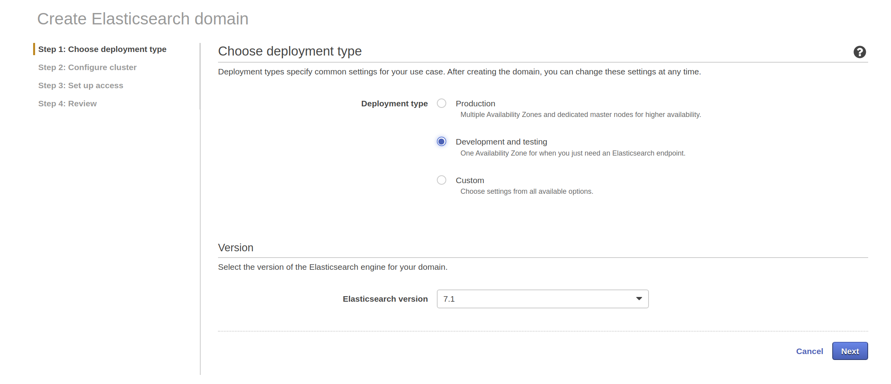
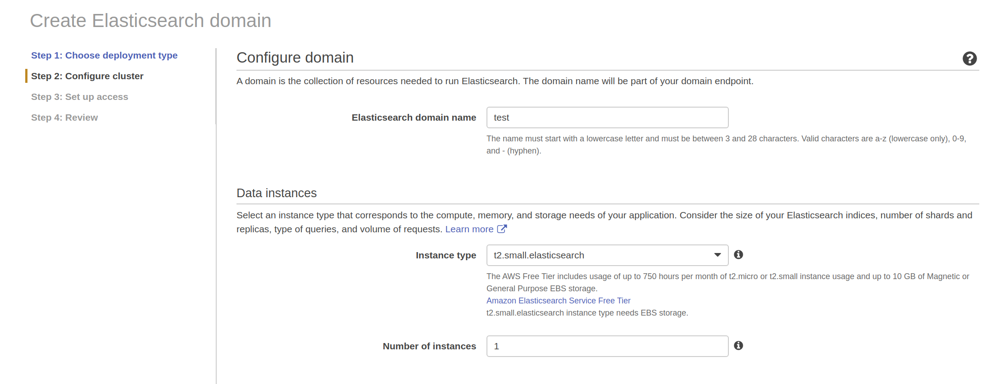
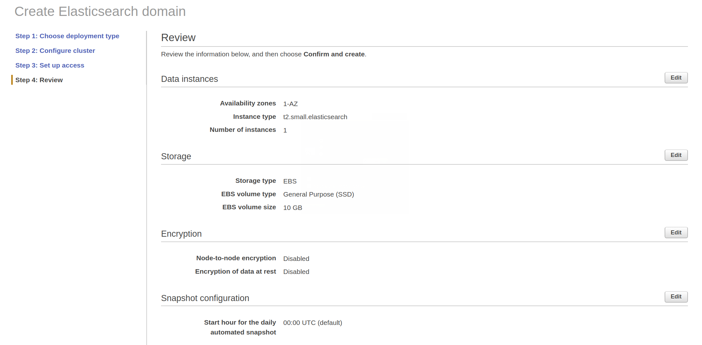
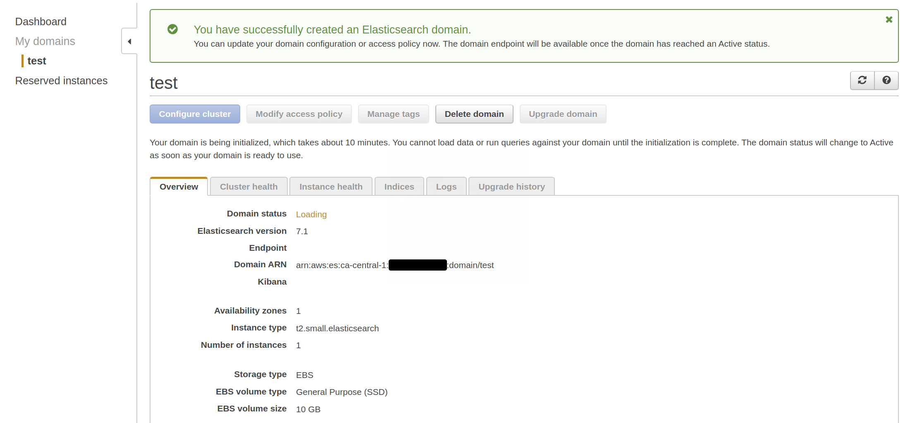

# Elastic


Getting up-to-speed with the __Elastic Stack__ (formerly the __ELK stack__) which consists of
 [Elasticsearch](http://www.elastic.co/products/elasticsearch),
 [Logstash](http://www.elastic.co/products/logstash), and
 [Kibana](http://www.elastic.co/products/kibana).


And now [Beats](http://www.elastic.co/products/beats).


## Contents

The content are as follows:

* [Motivation](#motivation)
* [Elasticsearch overview](#elasticsearch-overview)
* [Use Cases](#use-cases)
* [AWS](#aws)
    * [Create a domain](#create-a-domain)
* [Docker](#Docker)
* [Version](#version)
* [Health](#health)
* [Aliases](#aliases)
* [PUT](#put)
* [POSTs](#posts)
* [GET](#get)
    * [Specific query](#specific-query)
* [Kibana](#kibana)
    * [Kibana tools](#kibana-tools)
* [Searches](#searches)
* [DELETE](#delete)
    * [DELETE individual item](#delete-individual-item)
* [Podcasts](#podcasts)
    * [SE-Radio](#se-radio)
* [Reference](#reference)
    * [Glossary](#glossary)
    * [Indices and Aliases](#indices-and-aliases)
    * [Bulk API](#bulk-api)
    * [Update documentation](#update-documentation)
    * [Reindex API](#reindex-api)
    * [AWS Developer Guide](#aws-developer-guide)
    * [PUT and POST](#put-and-post)
* [Credits](#credits)

## Motivation

Having looked at [Cassandra with Python](http://github.com/mramshaw/Python_Cassandra), [Couchbase](http://github.com/mramshaw/RESTful-Couchbase) and [DynamoDB](http://github.com/mramshaw/DynamoDB),
 this time Elasticsearch is in the cross-hairs.

Under the covers ElasticSearch uses [Apache Lucene](http://lucene.apache.org/).

Elasticsearch is very similiar to [Apache Solr](http://lucene.apache.org/solr/).
Both ElasticSearch and Solr are built on top of Lucene, and seem to offer roughly
similiar features. It's worth remembering that ElasticSearch, while open-source,
is backed by a commercial (for-profit) company.

Amazon offers both as services: Elasticsearch is marketed as
 [Amazon Elasticsearch Service](http://aws.amazon.com/elasticsearch-service/)
 while Solr is marketed as [Amazon CloudSearch](http://aws.amazon.com/cloudsearch/).
Amazon Elasticsearch Service is based on a cluster of managed servers (where scaling
needs to be managed) while Amazon CloudSearch is a managed service which autoscales.

There are a number of options for Elasticsearch (on premise, etc), but I will be looking at Amazon Elasticsearch Service.

Amazon describes it as follows:

> Amazon Elasticsearch Service is a fully managed service that makes it easy for you to deploy, secure, and operate Elasticsearch at scale with zero down time.

[__at scale__, __zero down time__]

> The service offers open-source Elasticsearch APIs, managed [Kibana](http://aws.amazon.com/elasticsearch-service/the-elk-stack/kibana/), and integrations with
> [Logstash](http://aws.amazon.com/elasticsearch-service/the-elk-stack/logstash/) and other AWS Services, enabling you to securely ingest data from any source
> and search, analyze, and visualize it in real time.

[So a full ELK stack. This stack is popular with developers.]

> Amazon Elasticsearch Service lets you pay only for what you use – there are no upfront costs or usage requirements.

[So a good match for __serverless__ computing.]

All of the above quotes are from: http://aws.amazon.com/elasticsearch-service/

## Elasticsearch Overview

Elasticsearch is a __distributed__, __sharded__ database with __no required indices__.

It is a __NoSQL__ database, so theoretically __schema-less__ (although the recommended practice is to define a schema).

It is primarily oriented towards ___full-text search___.

In terms of NoSQL categories, it seems to usually be defined as a __real-time search and analytics engine__ first,
and a __Document store__ second. Of course, many relational databases also offer full-text search capabilities,
however it is probably its real-time streaming characteristics that make Elasticsearch attractive.

[As a document-store, it seem to offer a strong challenge to MongoDB. And it can also handle __search__.]

Elasticsearch seems to be very similiar to [Apache Cassandra](http://cassandra.apache.org/).

Cassandra has its own __CQL__ while Couchbase has __N1QL__; on the other hand Elasticsearch is __RESTful__.

> Scales good for reads, ok’ish for writes

From: http://vlkan.com/blog/post/2018/11/14/elasticsearch-primary-data-store/cncml-vienna-2019.pdf

Writes are handled via __shards__ while reads are handled by __replicas__. Replicas may be scaled up
dynamically (for instance, for Black Friday).

Its terminology is a little weird - for instance it refers to what might normally be called __databases__ as __indexes__.

Integrity is maintained with a [CAS](http://en.wikipedia.org/wiki/Compare-and-swap) (compare and swap) versioning mechanism.

It's a little unusual (for a database anyway) in that it offers __fuzzy search__ options.

## Use Cases

As noted above, Elasticsearch is optimized for __search__, and more specifically - ___full-text search___.

Due to it's ability to ingest and scan documents, it is becoming very useful for __data science__ also.

For log ingestion and analysis, offerings from __DataDog__ and __Splunk__ may be more feature-rich,
but this is still a very common use case for Elasticsearch.

## AWS

It is possible to create an AWS test cluster from http://www.elastic.co/ but it is also possible to do this from AWS itself.

So I'll be exploring the AWS option.

#### Create a domain

[AWS refers to a cluster as an 'Amazon ES domain'.]

Pretty straightforward from the AWS console:



And:



[Note that the __Instance type__ is set to __small__; the default is __large__.]


[A VPC is perhaps overkill for a quick test; likewise Cognito.]



[Note the mandatory daily snapshot - specifically the time at which it occurs.]



[Note that it takes about 10 minutes to create the domain, also that there are no endpoints yet.]

As we did not enable Cognito for Kibana we will need to whitelist our IP address.

If using the AWS CLI, all of the above (plus IP address whitelisting) can be done as follows:

```bash
$ aws es create-elasticsearch-domain \
 --domain-name test \
 --elasticsearch-version 7.1 \
 --elasticsearch-cluster-config InstanceType=t2.small.elasticsearch,InstanceCount=1 \
 --ebs-options EBSEnabled=true,VolumeType=standard,VolumeSize=10 \
 --access-policies '{"Version":"2012-10-17","Statement":[{"Effect":"Allow","Principal":{"AWS":"*"},"Action":["es:*"],"Condition":{"IpAddress":{"aws:SourceIp":["your_ip_address"]}}}]}'
```

## Docker

Let's see what Docker images there are:

```bash
$ docker search elasticsearch
NAME                                 DESCRIPTION                                     STARS               OFFICIAL            AUTOMATED
elasticsearch                        Elasticsearch is a powerful open source sear…   3830                [OK]
nshou/elasticsearch-kibana           Elasticsearch-7.1.1 Kibana-7.1.1                105                                     [OK]
itzg/elasticsearch                   Provides an easily configurable Elasticsearc…   68                                      [OK]
mobz/elasticsearch-head              elasticsearch-head front-end and standalone …   48
elastichq/elasticsearch-hq           Official Docker image for ElasticHQ: Elastic…   36                                      [OK]
elastic/elasticsearch                The Elasticsearch Docker image maintained by…   22
taskrabbit/elasticsearch-dump        Import and export tools for elasticsearch       18                                      [OK]
bitnami/elasticsearch                Bitnami Docker Image for Elasticsearch          18                                      [OK]
lmenezes/elasticsearch-kopf          elasticsearch kopf                              18                                      [OK]
barnybug/elasticsearch               Latest Elasticsearch 1.7.2 and previous rele…   17                                      [OK]
esystemstech/elasticsearch           Debian based Elasticsearch packing for Lifer…   15
monsantoco/elasticsearch             ElasticSearch Docker image                      11                                      [OK]
mesoscloud/elasticsearch             [UNMAINTAINED] Elasticsearch                    9                                       [OK]
justwatch/elasticsearch_exporter     Elasticsearch stats exporter for Prometheus     9
blacktop/elasticsearch               Alpine Linux based Elasticsearch Docker Image   8                                       [OK]
centerforopenscience/elasticsearch   Elasticsearch                                   4                                       [OK]
barchart/elasticsearch-aws           Elasticsearch AWS node                          3
dtagdevsec/elasticsearch             elasticsearch                                   3                                       [OK]
bitnami/elasticsearch-exporter       Bitnami Elasticsearch Exporter Docker Image     2                                       [OK]
phenompeople/elasticsearch           Elasticsearch is a powerful open source sear…   1                                       [OK]
jetstack/elasticsearch-pet           An elasticsearch image for kubernetes PetSets   1                                       [OK]
18fgsa/elasticsearch-ha              Built from https://github.com/18F/kubernetes…   0
axway/elasticsearch-docker-beat      "Beat" extension to read logs of containers …   0                                       [OK]
18fgsa/elasticsearch                 Built from https://github.com/docker-library…   0
wreulicke/elasticsearch              elasticsearch                                   0                                       [OK]
$
```

Okay, we will try the official release. Instructions are here:

    http://www.elastic.co/guide/en/elasticsearch/reference/current/docker.html

Apache 2.0 licensed versions are here:

    http://www.docker.elastic.co/

[Note that Elastic do not use the `latest` tag (which seems like a good practice) so a __tagged__ release must be installed.]

```bash
$ docker pull docker.elastic.co/elasticsearch/elasticsearch:7.3.1
7.3.1: Pulling from elasticsearch/elasticsearch
48914619bcd3: Pull complete
c00e9e7aed99: Pull complete
bfac725fd799: Pull complete
f1fe76a8ef9b: Pull complete
2a1b75592794: Pull complete
f33ae02b8315: Pull complete
ad8bc430d6cc: Pull complete
Digest: sha256:d43c5b93c027fbbfc5b24a69a786f66d6d4059360d8c1b9defb661f68dc24c74
Status: Downloaded newer image for docker.elastic.co/elasticsearch/elasticsearch:7.3.1
docker.elastic.co/elasticsearch/elasticsearch:7.3.1
$
```

Note that the virtual memory limit must be raised. On linux this is as follows:

```bash
$ sudo sysctl -w vm.max_map_count=262144
[sudo] password for xxxxx:
vm.max_map_count = 262144
$
```

Run the docker images:

```bash
$ docker run -p 9200:9200 -p 9300:9300 -e "discovery.type=single-node" --name es7.3.1 docker.elastic.co/elasticsearch/elasticsearch:7.3.1
...
$
```

[As usual, Ctrl-C to stop.]

And if we got to http://localhost:9200 in a browser, we should get:

```
{
  "name" : "be637d19e825",
  "cluster_name" : "docker-cluster",
  "cluster_uuid" : "7urUewFVT_i3pf7eCB1ssQ",
  "version" : {
    "number" : "7.3.1",
    "build_flavor" : "default",
    "build_type" : "docker",
    "build_hash" : "4749ba6",
    "build_date" : "2019-08-19T20:19:25.651794Z",
    "build_snapshot" : false,
    "lucene_version" : "8.1.0",
    "minimum_wire_compatibility_version" : "6.8.0",
    "minimum_index_compatibility_version" : "6.0.0-beta1"
  },
  "tagline" : "You Know, for Search"
}
```

#### Kibana

It looks like we don't get Kibana this way, so let's get that:

```bash
$ docker pull docker.elastic.co/kibana/kibana:7.3.1
...
$
```

The instructions are here:

    http://www.elastic.co/guide/en/kibana/7.3/docker.html

And run it:

```bash
$ docker run --link es7.3.1:elasticsearch -p 5601:5601 docker.elastic.co/kibana/kibana:7.3.1
...
$
```

[As usual, Ctrl-C to stop.]

And if we got to http://localhost:5601 in a browser, we should a Kibana console.

Click the wrench icon to navigate to the Kibana __Dev Tools__ console.

## Version

Let's see what version of Elasticsearch we are dealing with first.

From the Kibana __Dev Tools__ console:

```
GET /
```

[Click the green Play button to execute]

Response:

```
{
  "name" : "xxxxxxx",
  "cluster_name" : "xxxxxxxxxxxx:xxx-xxxxxx",
  "cluster_uuid" : "xxxxxxxxxxxxxxxxxxxxxx",
  "version" : {
    "number" : "x.x.x",
    "build_flavor" : "oss",
    "build_type" : "zip",
    "build_hash" : "xxxxxxx",
    "build_date" : "2019-04-08T13:15:27.206923Z",
    "build_snapshot" : false,
    "lucene_version" : "x.x.x",
    "minimum_wire_compatibility_version" : "x.x.x",
    "minimum_index_compatibility_version" : "x.x.x"
  },
  "tagline" : "You Know, for Search"
}
```

Note the version number (affects API calls, etc).

There was a breaking change going from 6.x.x versions -> 7.x.x versions, so keep [Semantic Versioning](http://semver.org/) in mind.

## Health

Let's check the health of our cluster:

From the Kibana __Dev Tools__ console:

```
GET _cat/health?v
```

Which should look something like the following:


## Aliases

A definition:

> aliases are like soft links or shortcuts to actual indexes
>
> the advantage is to be able to have an alias pointing to index1a while building or
> re-indexing on index2b and the moment of swapping them is atomic thanks to the alias

As:

> Renaming an alias is a simple remove then add operation within the same API. This operation is atomic,
> no need to worry about a short period of time where the alias does not point to an index

Also:

> Multiple indices can be specified for an action

And:

> We will talk more about the other uses for aliases later in the book. For now we will explain how to
> use them to switch from an old index to a new index with zero downtime.

All from: http://stackoverflow.com/questions/48907041/what-are-aliases-in-elasticsearch-for

## PUT

Let's create an index (database instance) first.

From the Kibana __Dev Tools__ console:

```
PUT school
```

[Creates index - Click the green Play button to execute]

Response:

```
{
  "acknowledged" : true,
  "shards_acknowledged" : true,
  "index" : "school"
}
```

To delete the index (database instance), there is [DELETE](#delete).

## POSTs

Now let's create some entries.

From the Kibana __Dev Tools__ console:

```
POST school/_doc/10
{
   "name":"Saint Paul School", "description":"ICSE Afiliation",
   "street":"Dawarka", "city":"Delhi", "state":"Delhi", "zip":"110075",
   "location":[28.5733056, 77.0122136], "fees":5000,
   "tags":["Good Faculty", "Great Sports"], "rating":"4.5"
}
```

[Click the green Play button to execute]

Response:

```
{
  "_index" : "school",
  "_type" : "_doc",
  "_id" : "10",
  "_version" : 1,
  "result" : "created",
  "_shards" : {
    "total" : 2,
    "successful" : 1,
    "failed" : 0
  },
  "_seq_no" : 0,
  "_primary_term" : 1
}
```

[Looks like anything starting with an underscore is metadata.]

And:

```
POST school/_doc/16
{
   "name":"Crescent School", "description":"State Board Affiliation",
   "street":"Tonk Road",
   "city":"Jaipur", "state":"RJ", "zip":"176114","location":[26.8535922,75.7923988],
   "fees":2500, "tags":["Well equipped labs"], "rating":"4.5"
}
```

[Click the green Play button to execute]

Response:

```
{
  "_index" : "school",
  "_type" : "_doc",
  "_id" : "16",
  "_version" : 1,
  "result" : "created",
  "_shards" : {
    "total" : 2,
    "successful" : 1,
    "failed" : 0
  },
  "_seq_no" : 0,
  "_primary_term" : 1
}
```

## GET

Let's get a description (definition) of our index.

From the Kibana __Dev Tools__ console:

```
GET school
```

[Click the green Play button to execute]

Response:

```
{
  "school" : {
    "aliases" : { },
    "mappings" : {
      "_doc" : {
        "properties" : {
          "city" : {
            "type" : "text",
            "fields" : {
              "keyword" : {
                "type" : "keyword",
                "ignore_above" : 256
              }
            }
          },
          "description" : {
            "type" : "text",
            "fields" : {
              "keyword" : {
                "type" : "keyword",
                "ignore_above" : 256
              }
            }
          },
          "fees" : {
            "type" : "long"
          },
          "location" : {
            "type" : "float"
          },
          "name" : {
            "type" : "text",
            "fields" : {
              "keyword" : {
                "type" : "keyword",
                "ignore_above" : 256
              }
            }
          },
          "rating" : {
            "type" : "text",
            "fields" : {
              "keyword" : {
                "type" : "keyword",
                "ignore_above" : 256
              }
            }
          },
          "state" : {
            "type" : "text",
            "fields" : {
              "keyword" : {
                "type" : "keyword",
                "ignore_above" : 256
              }
            }
          },
          "street" : {
            "type" : "text",
            "fields" : {
              "keyword" : {
                "type" : "keyword",
                "ignore_above" : 256
              }
            }
          },
          "tags" : {
            "type" : "text",
            "fields" : {
              "keyword" : {
                "type" : "keyword",
                "ignore_above" : 256
              }
            }
          },
          "zip" : {
            "type" : "text",
            "fields" : {
              "keyword" : {
                "type" : "keyword",
                "ignore_above" : 256
              }
            }
          }
        }
      }
    },
    "settings" : {
      "index" : {
        "creation_date" : "1566930221735",
        "number_of_shards" : "5",
        "number_of_replicas" : "1",
        "uuid" : "xxxxxxxxxxxxxxxxxxxxxx",
        "version" : {
          "created" : "6050499"
        },
        "provided_name" : "school"
      }
    }
  }
}
```

[fees is a ___long___, zip is a ___float___; others are text fields.]

#### Specific Query

Now let's try retrieving a specific entry.

From the Kibana __Dev Tools__ console:

```
GET /school/_search?q=name:"Saint Paul School"
```

[Click the green Play button to execute]

Response:

```
{
  "took" : 46,
  "timed_out" : false,
  "_shards" : {
    "total" : 5,
    "successful" : 5,
    "skipped" : 0,
    "failed" : 0
  },
  "hits" : {
    "total" : 1,
    "max_score" : 0.8630463,
    "hits" : [
      {
        "_index" : "school",
        "_type" : "_doc",
        "_id" : "10",
        "_score" : 0.8630463,
        "_source" : {
          "name" : "Saint Paul School",
          "description" : "ICSE Afiliation",
          "street" : "Dawarka",
          "city" : "Delhi",
          "state" : "Delhi",
          "zip" : "110075",
          "location" : [
            28.5733056,
            77.0122136
          ],
          "fees" : 5000,
          "tags" : [
            "Good Faculty",
            "Great Sports"
          ],
          "rating" : "4.5"
        }
      }
    ]
  }
}
```

## Kibana

Kibana is an open-source data visualization plugin for Elasticsearch.

#### Kibana tools

CURL (from Spanner - 'Copy as cURL'):

	curl -XGET "http://localhost:9200/school/_search?q=rating:4.5"

## Searches

Case is not important (it looks like text fields are canonicalized):

```
GET /_search
{
    "query": {
        "query_string" : {
            "default_field" : "city",
            "query" : "jaipur"
        }
    }
}
```

[Click the green Play button to execute]

Response:

```
{
  "took" : 53,
  "timed_out" : false,
  "_shards" : {
    "total" : 324,
    "successful" : 324,
    "skipped" : 0,
    "failed" : 0
  },
  "hits" : {
    "total" : 1,
    "max_score" : 0.2876821,
    "hits" : [
      {
        "_index" : "school",
        "_type" : "_doc",
        "_id" : "16",
        "_score" : 0.2876821,
        "_source" : {
          "name" : "Crescent School",
          "description" : "State Board Affiliation",
          "street" : "Tonk Road",
          "city" : "Jaipur",
          "state" : "RJ",
          "zip" : "176114",
          "location" : [
            26.8535922,
            75.7923988
          ],
          "fees" : 2500,
          "tags" : [
            "Well equipped labs"
          ],
          "rating" : "4.5"
        }
      }
    ]
  }
}
```

## Leaf query clauses

http://www.elastic.co/guide/en/elasticsearch/reference/current/query-dsl.html

#### match

Seems to be used for exact matches (EQ).

#### term

Seems to be used for text matching - contains the specified term (LIKE, etc).

#### range

Used for numeric matching (LT, LTE, GT, GTE).

```
GET /_search
{
  "query": {
    "range": {
      "fees": {
        "gt": "2500"
      }
    }
  }
}
```

[Click the green Play button to execute]

Response:

```
{
  "took" : 9,
  "timed_out" : false,
  "_shards" : {
    "total" : 324,
    "successful" : 324,
    "skipped" : 319,
    "failed" : 0
  },
  "hits" : {
    "total" : 1,
    "max_score" : 1.0,
    "hits" : [
      {
        "_index" : "school",
        "_type" : "_doc",
        "_id" : "10",
        "_score" : 1.0,
        "_source" : {
          "name" : "Saint Paul School",
          "description" : "ICSE Afiliation",
          "street" : "Dawarka",
          "city" : "Delhi",
          "state" : "Delhi",
          "zip" : "110075",
          "location" : [
            28.5733056,
            77.0122136
          ],
          "fees" : 5000,
          "tags" : [
            "Good Faculty",
            "Great Sports"
          ],
          "rating" : "4.5"
        }
      }
    ]
  }
}
```

It's pretty error-tolerant, even the following worked:

```
GET /_search
{
  "query": {
    "range": {
      "eventAt": {
        "gte": "2500"
      }
    }
  }
}
```

## term query may return poor results when searching text fields

http://www.elastic.co/guide/en/elasticsearch/reference/current/query-dsl-term-query.html#avoid-term-query-text-fields

## DELETE

Deletes the specified index (and apparently all of the indexed data as well):

```
DELETE school
```

[Click the green Play button to execute]

Response:

```
{
  "acknowledged" : true
}
```

#### DELETE individual item

```
DELETE school/_doc/10
```

[Click the green Play button to execute]

Response:

```
{
  "_index" : "school",
  "_type" : "_doc",
  "_id" : "10",
  "_version" : 2,
  "result" : "deleted",
  "_shards" : {
    "total" : 2,
    "successful" : 1,
    "failed" : 0
  },
  "_seq_no" : 1,
  "_primary_term" : 1
}
```

[Note that __result__ is __deleted__; also __version__ is __2__ as index has been deleted and then re-created.]

## Podcasts

Some of the following podcast episodes may be helpful for getting an overview of Elasticsearch.

#### SE-Radio

> Software Engineering Radio is a podcast targeted at the professional software developer.

A good overview of the Elastic Stack:

    http://www.se-radio.net/2017/05/se-radio-episode-292-philipp-krenn-on-elasticsearch/

Jeff Meyerson, the interviewer, went on to found [Software Engineering Daily](http://softwareengineeringdaily.com/).

As the stack has evolved, Logstash seems to have spilt into [Beats](http://www.elastic.co/products/beats) (which are
aggregation agents that can ship to either Elasticsearch or Logstash) and [Logstash](http://www.elastic.co/products/logstash)
(which is used for data ingestion and parsing - and also enrichment [for instance, geolocating IP addresses]).

[Apparently geolocation has evolved to become a strength of Elasticsearch. And __types__ are on their way out.]

Presumably well-structured data can be shipped to Elasticsearch directly by Beats, but less well-structured data
(that may need to be parsed, processed, aggregated, transformed or enriched) must be passed to Logstash by Beats.

## Reference

Some useful references follow.

#### Glossary

Probably the place to start:

	http://www.elastic.co/guide/en/elasticsearch/reference/current/glossary.html

For instance, about __shards__:

> A shard is a single Lucene instance

Amazon layers their branding on top of Elastic's, so in AWS a cluster is known as an Amazon ES Domain.
Probably other terms are similiarly translated.

#### Indices and Aliases

A little long, but worth reading:

    http://www.elastic.co/guide/en/elasticsearch/reference/current/indices-aliases.html

#### Bulk API

> The bulk API makes it possible to perform many index/delete operations in a single API call. This can greatly increase the indexing speed.

    http://www.elastic.co/guide/en/elasticsearch/reference/current/docs-bulk.html

Note that a successful __create__ returns a __201__ HTTP status code while an unsuccessful __delete__ returns a __404__ HTTP status code.

The __update__ (usually an __upsert__ I think) should normally return a __200__ HTTP status code.

> When using the `update` action, `retry_on_conflict` can be used as a field in the action itself
> (not in the extra payload line), to specify how many times an update should be retried in the case of a version conflict.

And:

> The `update` action payload supports the following options: `doc` (partial document), `upsert`, `doc_as_upsert`, `script`, `params` (for script),
> `lang` (for script), and `_source`. See update documentation for details on the options.

[Both quotes are from the article linked above.]

#### Update documentation

The update documentation is available here:

    http://www.elastic.co/guide/en/elasticsearch/reference/current/docs-update.html

#### Reindex API

Note that the `destination` index must be set up before the reindex:

    http://www.elastic.co/guide/en/elasticsearch/reference/current/docs-reindex.html

#### AWS Developer Guide

Probably definitive when working with [Amazon Elasticsearch Service](http://aws.amazon.com/elasticsearch-service/):

    http://docs.aws.amazon.com/elasticsearch-service/latest/developerguide/what-is-amazon-elasticsearch-service.html

#### PUT and POST

	http://www.elastic.co/guide/en/elasticsearch/reference/current/docs-index_.html

__Versioning__ is complicated; can also specify __timeouts__.

## Credits

While I mostly did my own experiments, I started from:

	http://www.tutorialspoint.com/elasticsearch/elasticsearch_populate.htm

All of my testing was from the Kibana __Dev Tools__ console.
